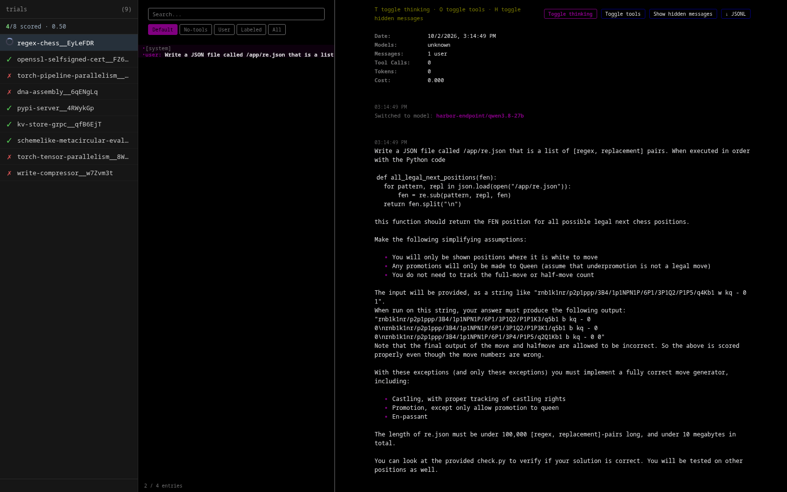

# pi-replay

Replay and watch [pi](https://github.com/badlogic/pi-mono) coding-agent runs from
[terminal-bench](https://github.com/laude-institute/terminal-bench) (harbor) job artifacts —
in your terminal, or live in the browser with a trial sidebar.

## Why

When you launch a batch of terminal-bench trials backed by the pi agent, each trial writes
its native pi session files under `<job>/<trial>/agent/pi/sessions/*.jsonl`. This tool
turns those back into something you can actually read:

- **Terminal replay** of a finished trial (assistant / user / tool calls / results)
- **`--live`** follows a running trial like an asciinema play
- **`--html`** serves a live viewer: pi's own full-fidelity HTML export in an iframe, with a
  scrollable sidebar of all trials in the job, pass/fail/running status, a spinner for
  in-progress trials, and a running success score

## Install

No dependencies beyond the runtime tools:

- bash, jq (terminal modes)
- node ≥ 16 (html mode)
- the `pi` CLI on your PATH (html mode uses `pi --export` to render sessions)

```sh
git clone https://github.com/tony-dwire/terminal-bench-pi-viewer.git
cd terminal-bench-pi-viewer
export PATH="$PWD/bin:$PATH"
```

## Usage

```sh
# render a finished trial in the terminal
pi-replay jobs/2026-09-30__20-55-19/build-cython-ext__USv7taD

# follow a running trial
pi-replay jobs/2026-09-30__20-55-19/build-cython-ext__USv7taD --live

# live HTML viewer for a whole job (or a single trial — the job is discovered)
pi-replay jobs/2026-09-30__20-55-19 --html
```

`--html` prints a `http://127.0.0.1:<port>/` URL, opens your browser, and serves until
Ctrl-C. The page polls each second and re-renders when the session file changes, so you can
watch the agent work in real time.



### The HTML viewer

- **Sidebar** lists every trial in the job that has pi sessions, most recent first, with
  status icons: ✓ pass · ✗ fail · ⚠ error/cancelled · spinner while running
- **Score line** under the header: passes / scored trials, truncated to two digits (e.g. `3/5 scored · 0.60`)
- **Main pane** shows pi's own export of the selected session (session tree, search, tool calls),
  hot-swapped with double buffering so refreshes never flicker or scroll-jump
- Selected trial is tracked in the URL hash, so a reload (or a bookmark) resumes where you were

## How it works

`--html` mode runs a small zero-dependency node server (`lib/server.js`):

| route        | purpose                                                        |
|--------------|----------------------------------------------------------------|
| `/`          | wrapper page: sidebar + iframe (`lib/viewer.html` + `lib/viewer.js`) |
| `/trials`    | JSON list of trials with pi sessions, with verifier-derived status |
| `/version?t=`| freshness probe per trial (mtime + size)                        |
| `/export?t=` | `pi --export` HTML for that trial, cached until the session changes |

Status comes from each trial's `result.json` (`verifier_result.rewards.reward`):
reward ≥ 1.0 → pass, ≤ 0.0 → fail, no verifier result → error, no result yet → running.

## License

MIT — see [LICENSE](LICENSE).
